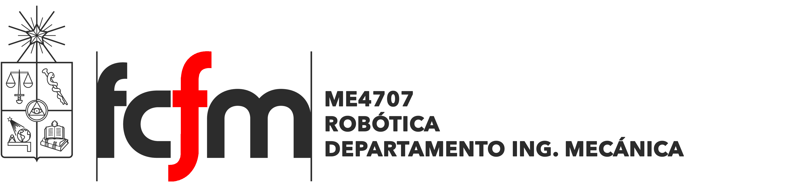

Este repositorio contiene los talleres prácticos y el material complementario del curso ME4707 Robótica.

## Google Colab
Para la realización de los talleres prácticos de programación del curso, es conveniente que todos utilizemos la misma plataforma y así podamos evitar errores de compatibilidad o de instalación. [**Google Colaboratory**](https://colab.research.google.com/notebooks/welcome.ipynb) es un entorno de Jupyter notebook gratuito que se ejecuta completamente en la nube. La plataforma permite tanto escribir como ejecutar código, y solo se requiere de una cuenta google.

https://colab.research.google.com/notebooks/welcome.ipynb

Dentro de este repositorio podrá encontrar los notebooks (\*.ipynb) de los distintos workshops a realizar a lo largo del curso. Descárguelos y ábralos dentro de su propia sesión de Colab.

## Clonar GitHub
En caso de requerir importar archivos y/o elementos de este repositorio a un entorno de Google Colab, puede clonarlo directamente mediante:

`! git clone https://github.com/cherrerab/roboticafcfm.git`

Si el repositorio se ha clonado correctamente, notará que en la carpeta de archivos `/content` se habrá creado el directorio `roboticafcfm`. Para utilizar este directorio dentro de la sesión, utilice el siguiente comando:

`%cd /content/roboticafcfm`

## Tutorial Numpy
Numpy es quizás la librería más utilizada en lo que respecta a Python, se utiliza extensamente en la ciencia de datos y, más importante para el curso, en el procesamiento de imágenes. Fundamentalmente, está orientada a la manipulación de arreglos multidimensionales, para lo cual cuenta con estructuras de datos y operaciones especializadas. En este tutorial aprenderá las funcionalidades básicas de esta librería que le permitirán abordar los próximos workshops del curso.

## Color Segmentation
La segmentación, si bien bajo muchos aspectos consiste en una operación bastante simple, es un proceso bastante útil a la hora de desarrollar algoritmos de detección de objetos o tracking. En términos simples, segmentar una imagen consiste en seccionar o aislar zonas de una imagen en función de algún atributo, como por ejemplo, intensidad o color. En este tutorial aprenderá los primeros pasos en cuanto a procesamiento de imágenes, desde cargar las imágenes como arreglos numéricos, hasta manipular sus valores mediante filtros y segmentadores.

  
